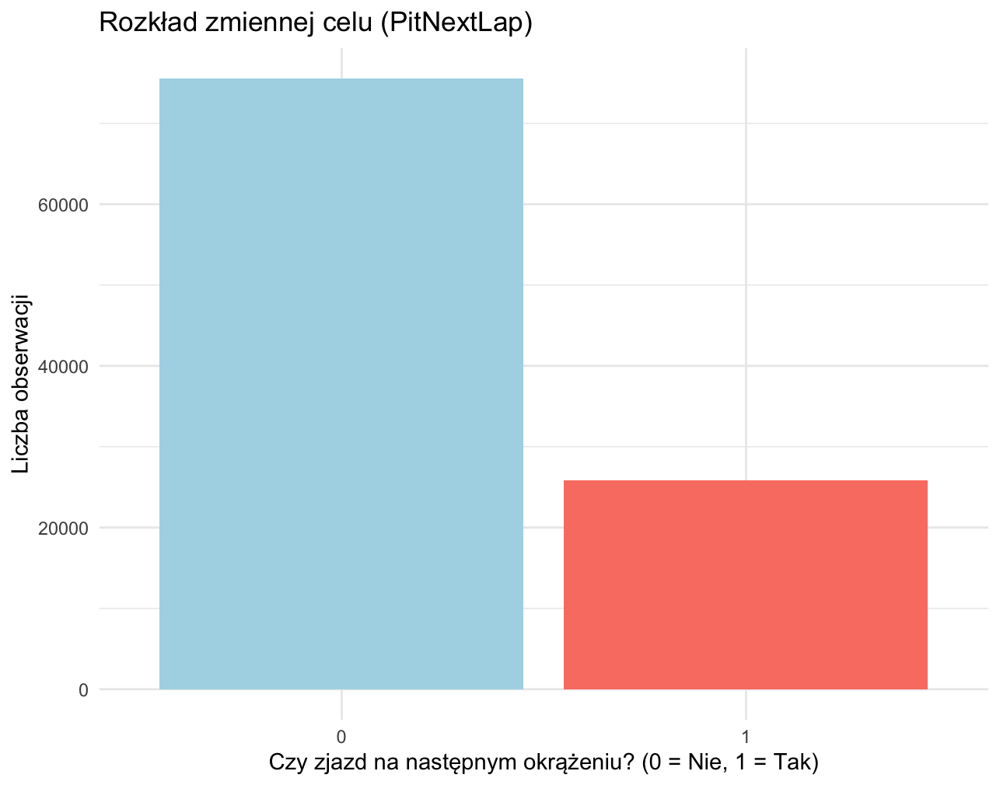
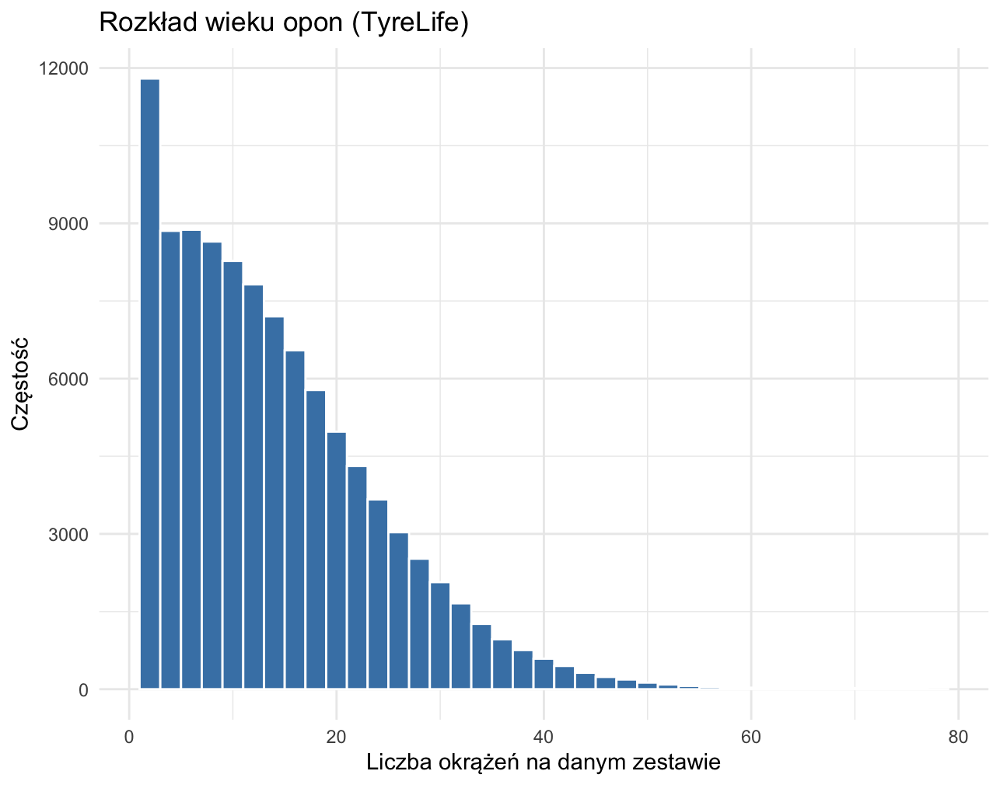
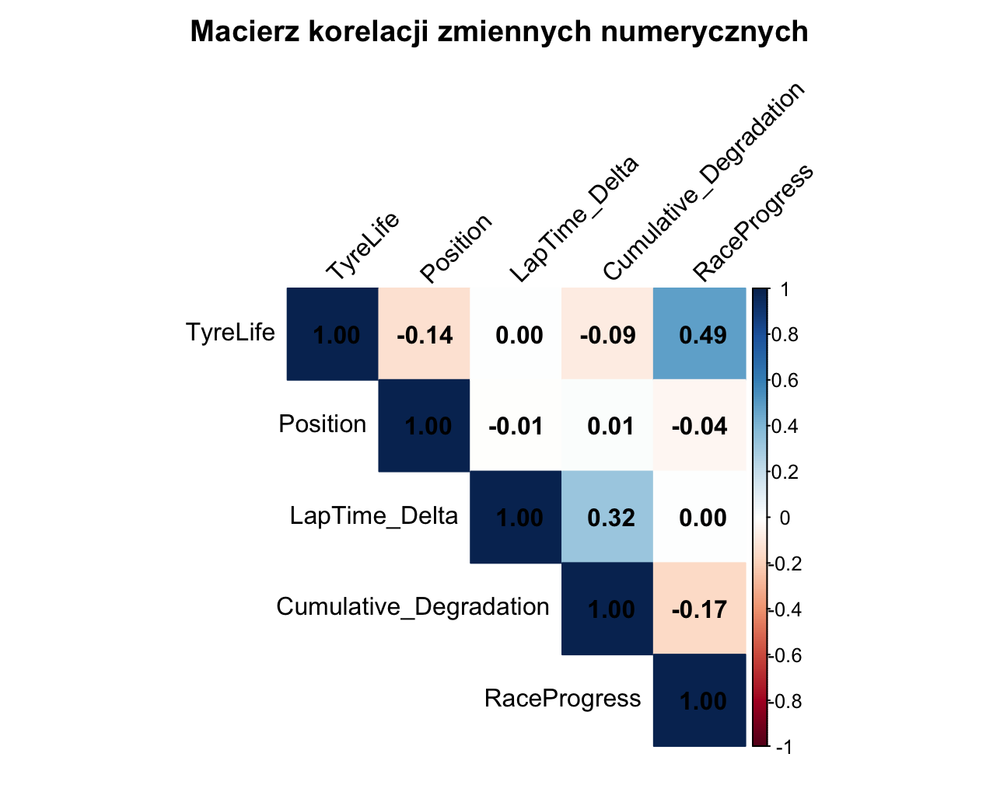
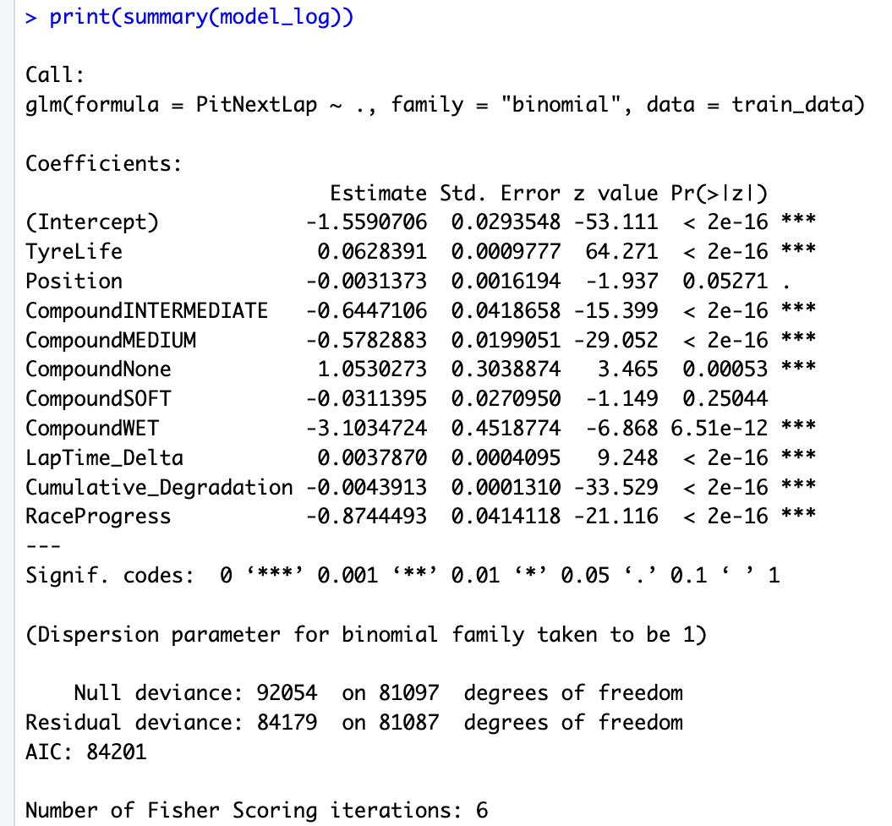
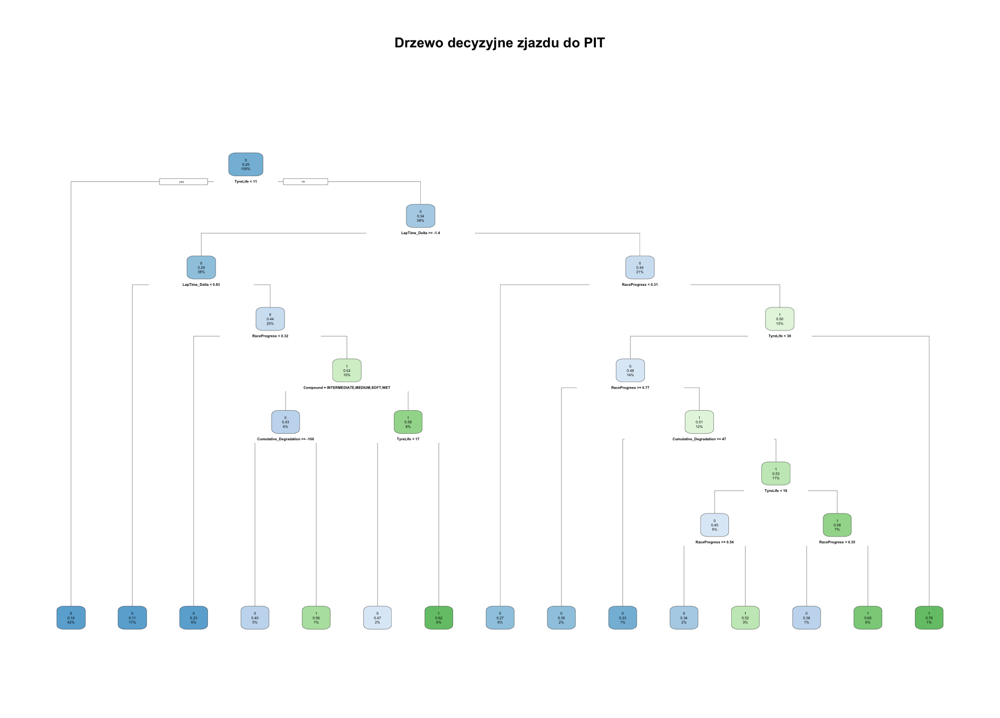
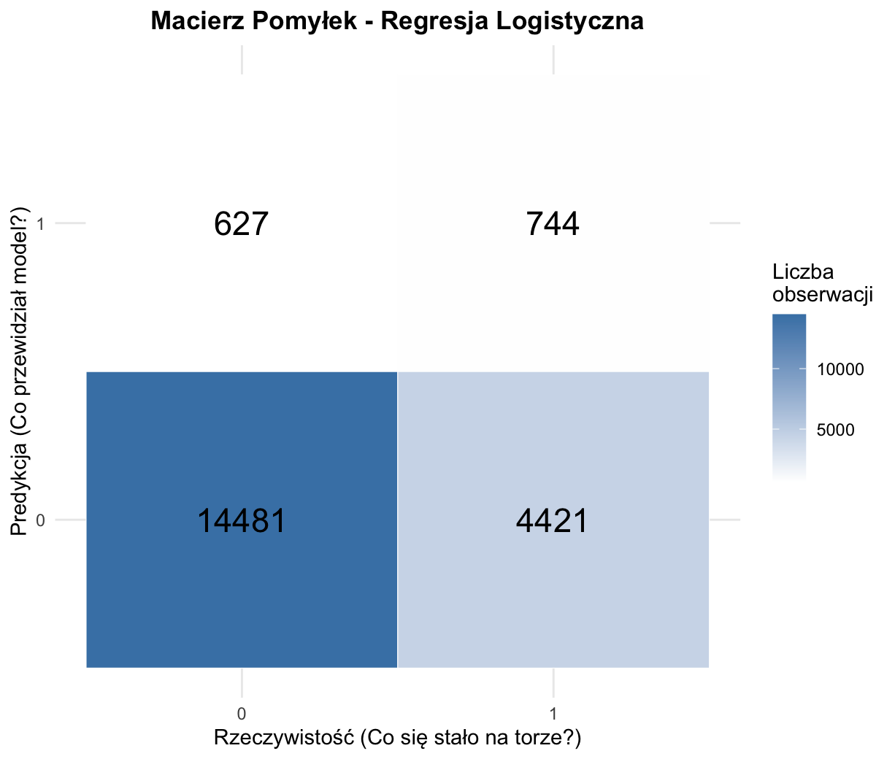
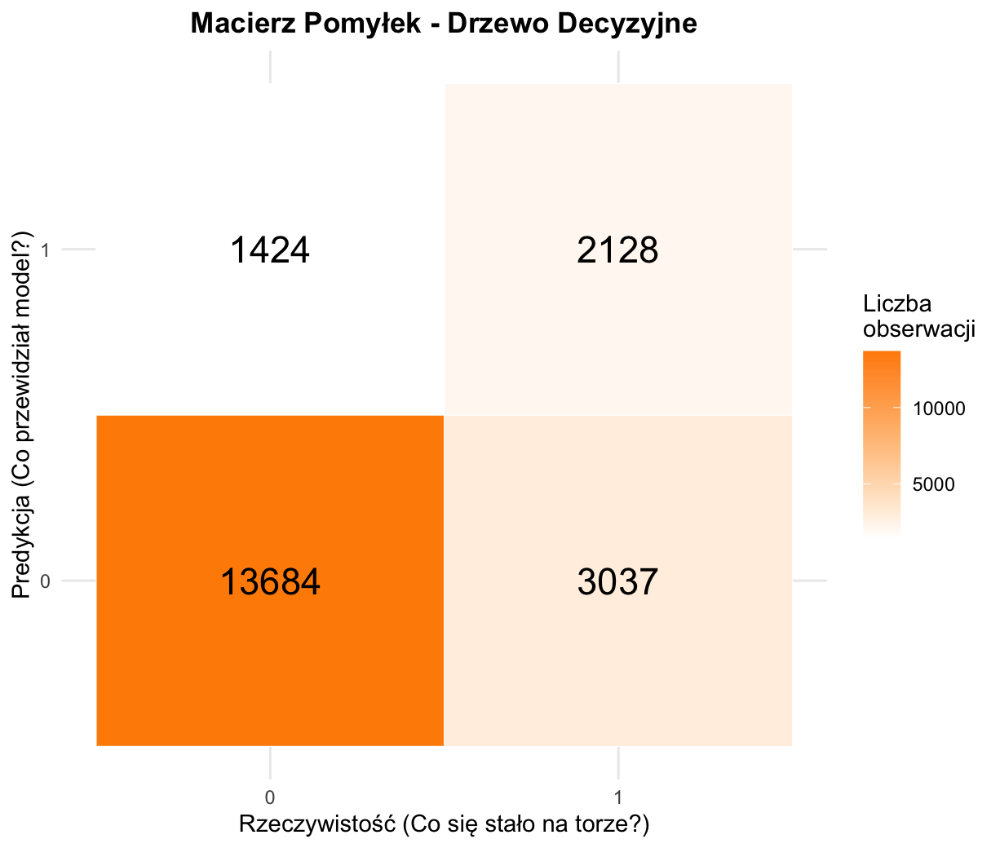
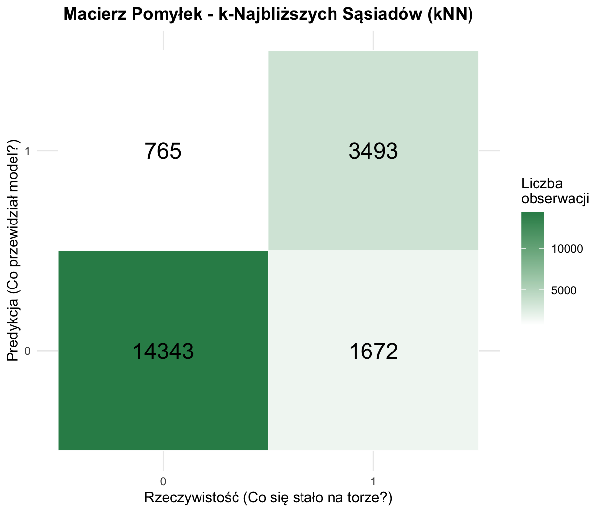

# 🏎️ Analiza strategii zjazdów do Pit Stopu w Formule 1 z wykorzystaniem uczenia maszynowego

**Autorki:** Julia Estkowska i Maja Zontek  
**Przedmiot:** Pracownia analizy danych / Modelowanie matematyczne i analiza danych MFI UG
**Technologie:** R (`caret`, `rpart`, `ggplot2`, `dplyr`, `class`)

---

## 1. Wprowadzenie i cel analizy
Celem niniejszego projektu jest zbudowanie i porównanie modeli uczenia maszynowego przewidujących decyzję o zjeździe kierowcy Formuły 1 do alei serwisowej na kolejnym okrążeniu (`PitNextLap`). Analiza opiera się na parametrach opon, czasach okrążeń oraz postępie wyścigu. Predykcja tego zdarzenia ma kluczowe znaczenie dla optymalizacji strategii wyścigowej.

## 2. Opis i struktura zbioru danych
Wykorzystany w analizie zbiór danych dostarcza szczegółowych informacji z wyścigów Formuły 1 na poziomie pojedynczych okrążeń (lap-level data). Został on stworzony z myślą o modelowaniu uczenia maszynowego i analizie strategii wyścigowych. Surowe dane telemetryczne zostały przetworzone do ustrukturyzowanej formy, wzbogaconej o inżynierię cech (feature engineering).

W zbiorze znajdują się następujące kluczowe zmienne:
* **Zmienne identyfikacyjne i wyścigowe:** `Year` (sezon), `Race` (nazwa Grand Prix), `Driver` (kierowca), `Position` (pozycja na torze), `LapNumber` (numer okrążenia), `RaceProgress` (ułamek ukończonego wyścigu od 0 do 1).
* **Parametry opon:** `Compound` (mieszanka opon), `Stint` (numer zmiany opon), `TyreLife` (liczba okrążeń przejechanych na danym zestawie), `Normalized_TyreLife`.
* **Metryki wydajnościowe:** `LapTime_Delta` (różnica czasu względem poprzedniego okrążenia), `Cumulative_Degradation` (skumulowany spadek wydajności opony).
* **Zmienna celu (Target variable):** `PitNextLap` (zmienna binarna 0/1 określająca, czy na kolejnym okrążeniu kierowca zjedzie do alei serwisowej).

## 3. Analiza eksploracyjna danych (EDA)

### 3.1. Rozkład zmiennej celu i wieku opony
W strukturze danych słupek odpowiadający klasie "0" (brak zjazdu) jest dominujący, podczas gdy klasa "1" (zjazd) stanowi niewielki odsetek wszystkich obserwacji (ok. 25.4%).

**Wniosek:** Dane są silnie niezbalansowane. Oznacza to, że będziemy musieli uważnie dobierać metryki oceny modeli – zwykła dokładność (Accuracy) byłaby w tym przypadku zwodnicza. Konieczna jest optymalizacja pod kątem czułości i miary F1.

### 3.2. Analiza korelacji
Najwyższa korelacja zaobserwowana w macierzy to zaledwie 0.49 (pomiędzy postępem wyścigu a wiekiem opony – co jest zjawiskiem logicznym), a reszta to słabe zależności (ok. 0.32) lub całkowity brak korelacji.

**Wniosek:** Ponieważ żadna ze zmiennych nie przekracza niebezpiecznego progu korelacji (np. 0.7 czy 0.8), nie występuje tu problem współliniowości (multicollinearity). Pozwala to na bezpieczne użycie zmiennych w modelach parametrycznych.

## 4. Metodologia i przygotowanie danych
Decyzje metodologiczne oparto na klasycznych założeniach uczenia maszynowego:
* **Podział danych:** Zbiór podzielono na uczący (80%) i testowy (20%) z wykorzystaniem ziarna losowości `set.seed(2026)`.
* **Przetwarzanie (Preprocessing):** Przed modelowaniem za pomocą algorytmu kNN, wszystkie zmienne numeryczne zostały wystandaryzowane. Zmienne kategoryczne zostały poddane transformacji na czynniki (*factor* / *dummy variables*).

## 5. Budowa i interpretacja modeli predykcyjnych

### 5.1. Regresja Logistyczna
Model ujawnił, które predyktory są najbardziej istotne dla podjęcia decyzji (oznaczone statystycznie trzema gwiazdkami `***`):
* `TyreLife` (współczynnik dodatni) – im starsza opona, tym wyższe prawdopodobieństwo zjazdu do pit stopu.
* `LapTime_Delta` (współczynnik dodatni) – pogorszenie czasu okrążenia zwiększa szanse na zjazd.
* `RaceProgress` oraz `Cumulative_Degradation` są silnie istotne.
Zmienna `Position` ma marginalne znaczenie przy podejmowaniu decyzji w porównaniu do samego stanu ogumienia.

### 5.2. Drzewo Decyzyjne
Wytrenowano model drzewa decyzyjnego z parametrem złożoności `cp = 0.005`, chroniącym przed przeuczeniem (pruning). Model ten zwraca bardzo użyteczne, interpretowalne reguły biznesowe:
* **Korzeń drzewa:** Głównym czynnikiem jest wiek opony. Jeśli `TyreLife < 11`, prawdopodobieństwo zjazdu jest marginalne (14%).
* **Sytuacje wysokiego ryzyka (76%):** Najwyższą szansę na zjazd model identyfikuje przy oponach skrajnie zużytych (`TyreLife >= 38`), gdy wyścig przekroczył pierwszą fazę (`RaceProgress >= 0.31`).
* **Efekt cliff:** Na twardych oponach (`HARD`), gdy wiek przekroczy 17 okrążeń, a czas okrążenia nagle pogorszy się o niemal sekundę (`LapTime_Delta >= 0.83s`), prawdopodobieństwo zjazdu gwałtownie rośnie aż do 62%.

### 5.3. Algorytm k-Najbliższych Sąsiadów (kNN)
Wykorzystano nieparametryczny model kNN (dla `k=5` sąsiadów) oparty na głosowaniu większościowym w wielowymiarowej (wystandaryzowanej) przestrzeni cech.

## 6. Ewaluacja i porównanie modeli

W celu rzetelnej oceny wygenerowano macierze pomyłek na zbiorze testowym. Ze względu na niezbalansowanie klas, skupiono się na Czułości (Sensitivity) oraz mierze F1-Score.

  
  
  

* **Regresja Logistyczna (Najsłabszy model):** Czułość na poziomie zaledwie **14.4%** i F1 równe **0.22**. Liniowa granica decyzyjna nie radzi sobie z nieliniowymi zjawiskami na torze, a domyślny próg 0.5 sprawia, że model przegapia ponad 85% prawdziwych zjazdów.
* **Drzewo Decyzyjne (Model kompromisowy):** Czułość **41.2%**, F1 równe **0.48**. Klasyczny dylemat między interpretowalnością (tzw. algorytm "białej skrzynki") a czystą mocą predykcyjną.
* **k-Najbliższych Sąsiadów (Zwycięzca):** Zdeklasował pozostałe algorytmy. Osiągnął znakomitą czułość rzędu **67.6%** przy jednoczesnym wzroście precyzji do aż **82.0%** (F1 = **0.741**). Balanced Accuracy wyniosło ponad 81%. Doskonale radzi sobie z wykrywaniem zjazdów poprzez grupowanie podobnych "momentów" wyścigowych.

## 7. Wnioski końcowe
1. **Złożoność decyzyjna:** Decyzja o zjeździe do pit-stopu ma charakter silnie nieliniowy. Modele parametryczne (Regresja Logistyczna) są niewystarczające. Najlepsze rezultaty przynosi podejście oparte na lokalnym podobieństwie zdarzeń (zwycięski algorytm kNN).
2. **Kluczowe czynniki:** Analiza ujawnia, że decydującym czynnikiem jest zużycie opon (`TyreLife`) oraz nagłe załamanie tempa wyścigowego (`LapTime_Delta`).
3. **Znaczenie pozycjonowania na torze:** Wpływ samej pozycji w stawce w momencie zjazdu ma znaczenie marginalne w stosunku do czynników determinujących przyczepność bolidu.

---
### ⚙️ Jak uruchomić projekt?
1. Skonfiguruj środowisko R.
2. Pobierz zawartość repozytorium (w tym dane `f1_strategy_dataset_v4.csv`).
3. Zaktualizuj ścieżkę ładowania danych w skrypcie i uruchom plik `F1_PitStop_Prediction.R`.
